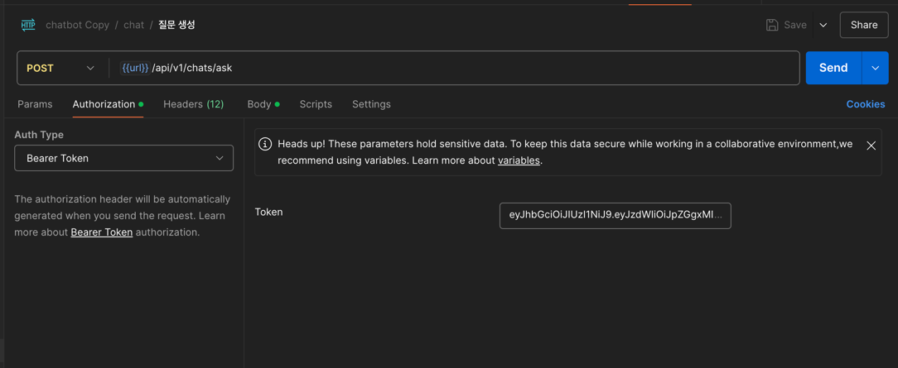

# 🛠️ 챗봇 서비스 (Chatbot Service)

Spring Boot 기반의 챗봇 서비스로, OpenAI API를 활용하여 사용자와 대화할 수 있는 기능을 제공합니다.  
PostgreSQL 데이터베이스를 사용하며, Docker Compose를 통해 컨테이너 기반으로 실행됩니다.

---

## 🚀 실행 방법

### 1️⃣ **PostgreSQL 실행**
Docker Compose를 이용하여 PostgreSQL과 Spring Boot 애플리케이션을 실행합니다.

```bash
docker-compose up -d
```

### 2. postman json 파일을 import 합니다. 
### 3. application. yml 을 수정합니다.
#### "{$api-key}" 부분을 api key 값으로 수정합니다.
### 4. spring project 를 실행합니다.
### 5. 회원 가입, 로그인을 진행합니다.
### 6. 로그인 결과 token 값을 아래 사진과 같이 postman 에 입력 후 api 를 호출합니다.

```bash
{
    "success": true,
    "message": "SUCCESS",
    "data": {
        "userId": "399dbb31-5102-4778-a242-aa94fb4a4c0d",
        "email": "idh1007@naver.com",
        "username": "임동혁",
        "token": "eyJhbGciOiJIUzI1NiJ9..."
    },
    "timestamp": "2025-02-16T18:54:37"
}
```

### 7. 질문 생성 api 를 호출합니다
### 8. 쓰레드 리스트 조회 api 를 호출하빈다.
